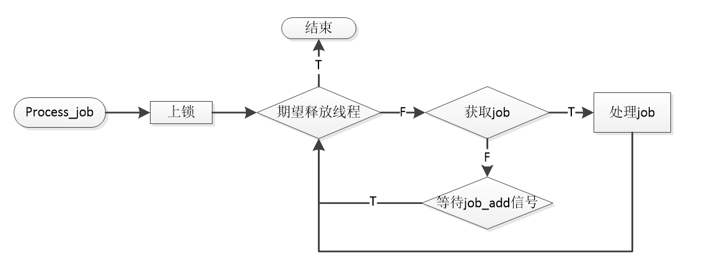
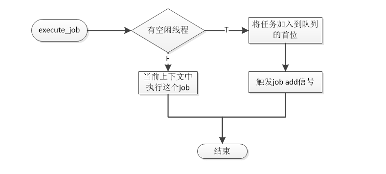
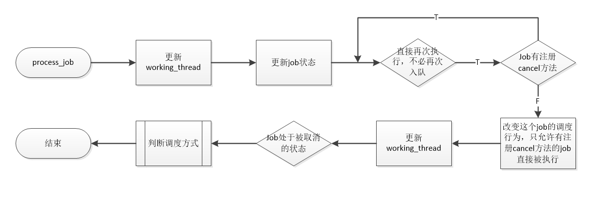
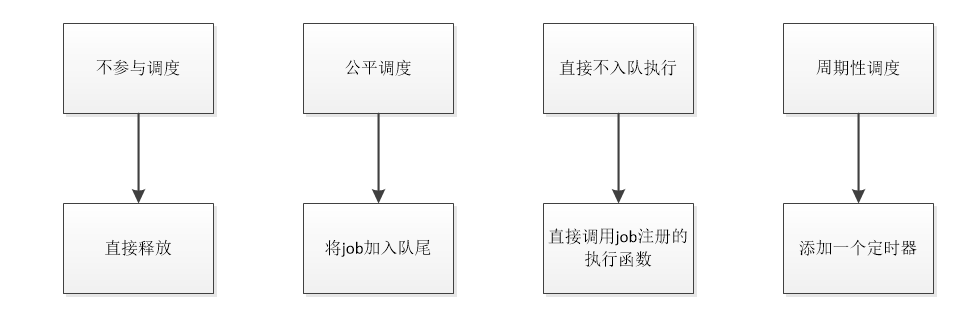

# 线程池设计文档

## 一. 目的

​	创建一个线程池管理模块，他仅需要满足如下功能即可：

* 创建一个支持N线程的线程池
* 销毁一个线程池
* 线程池中的线程数量可调整
  * 向线程池中增加线程
  * 从线程池中减少线程
* 可以向线程池中添加任务

## 二. 总体设计

​	每个线程交给一个worker的结构体进行管理，创建一个线程池就是创建一个worker队列，在对线程池进行CRUD时需要使用线程锁来保护数据。

​	我们希望创建的线程阻塞在一个名为“job add”的信号上，只有我们为线程池添加任务的时候，线程才会去真正执行这个任务。

​	我们将新创建的任务称为job，并存储在一个名为job的队列中，当为线程池添加任务的时候，就把任务入队，并且广播这个事件。

​	线程池中线程数量的调整是一个特殊的job。

​	我们希望在销毁线程池的时候终止所有job，并释放相关资源，所以针对job，他需要有一个cancel()的方法，在线程退出后我们希望他要尝试向主线程发送一个终止信号，以便主线程进行资源的回收。

​	

## 三. 详细设计

### 3.1 结构体设计

​	我们将从小到大，来设计整个模块中的结构体。

#### 1. job

​	job用来描述用户提供的任务，每个任务都有自己的执行状态、执行函数、取消函数、销毁函数。所以我们将他设计为如下结构。

​	status字段表示当前的job进行到什么阶段了。也是被线程池调度时关键的参数。

~~~c
typedef struct job_t job_t;
typedef enum job_status_t job_status_t;

enum job_status_t 
{
	JOB_STATUS_QUEUED = 0,
	JOB_STATUS_EXECUTING,
	JOB_STATUS_CANCELED,
	JOB_STATUS_DONE,
};

struct job_t
{
    job_status_t status;
    bool (*cancel)(job_t *this);
    void (*execute)(job_t *this);
    void (*destory)(job_t *this);
};
~~~

​	为了管理多任务，我们job保存在一个队列中

~~~c
typedef struct job_queue job_q_t;

struct job_entry
{
    job_t job;
    TAILQ_ENTRY(job_entry);
};

TAILQ_HEAD(job_queue, job_entry);
~~~

#### 2. thread

​	我们希望有一个结构体可以用来描述一个线程

~~~c
typedef void *(*thread_main_t)(void *arg);
typedef struct thread_t thread_t;

struct thread_t
{
    pthread_t tid;
    thread_main_t main;
    void *arg;
};
~~~

#### 3. worker

​	worker将会把一个线程和一个job进行关联，同时，为了每个线程方便地了解整个线程池的状态（例如锁状态、信号量状态、期望的线程数量等），也会保留一个指向线程池的指针。

~~~c
struct worker_thread_t
{
    private_processor_t *processor;
    job_t *job;
    thread_t tid;
};
~~~

​	我们需要一个worker队列来管理每一个worker，这里使用的<sys/queue.h>提供的TAILQ队列。

~~~c
typedef struct thread_queue thread_q_t;

struct worker_entry
{
    worker_thread_t worker;
    TAILQ_ENTRY(worker_entry) entries;
};

TAILQ_HEAD(thread_queue, worker_entry);
~~~

#### 4. 线程池

​	线程池需要一些统计量来保存当前线程池状态，例如当前线程池线程数量，期望线程数量，执行工作的线程数量，一个管理线程的队列，一个管理任务的队列，一个保护线程池的锁，一个新增任务的信号。

~~~c
typedef struct processor_t processor_t;

struct processor_t
{
    /* public interface */
    
    
	/* private member */
    int total_threads;
    int desired_threads;
    int working_threads;
    thread_q_t threads;
    job_q_t jobs;
    pthread_mutex_t mutex;
    pthread_cond_t job_add;
};
~~~

### 3.2 接口设计

​		本节将从上到下来设计所需要的接口

#### 1. 线程池

​	创建线程池，取消所有worker线程，销毁线程池，配置线程池：

~~~shell
processor_t *processor_create();

struct processor_t
{
    /* public interface */
    void (*set_threads)(processor_t *this, int count);
    void (*cancel)(processor_t *this);
    void (*destory)(processor_t *this);
    
	/* private member */
};
~~~

​	set_threads()将创建count个worker线程，每个worker线程阻塞等待job add信号。这里需要注意，不论是创建worker还是期望释放线程，都会广播job_add信号，结合process_jobs函数（后面会提到），就可以实现线程数的调整。

~~~c
static void __processor_set_threads(processor_t *this, int count)
~~~

​	cancel()将期望子线程数归零，并通知每个job取消执行任务，并阻塞在一个线程终止信号上，如果等到当前子线程数归零，则开始回收线程资源，并释放worker队列和job队列。

#### 2. worker

​	创建worker

~~~c
static struct worker_entry *worker_create(processor_t *processor, thread_main_t main)
~~~

​	在这个函数中，我们会对worker_entry结构体中的字段进行初始化，核心的动作是创建一个线程实例，该线程实例将会调用第二个参数main所指的回调函数。

​	

​	由于我们的worker要做的事情是等待job_add的信号，有job的时候去处理他，这也是线程池中的一个核心函数，我们会从job队列中取出job，并且去执行这个job。

​	由于在set_threads的时候会广播job_add信号，所以所有空闲的线程都会收到，如果发现我们期望释放这个线程，那么这个线程就会退出，实现了线程数量的调整。

~~~c
static void *process_jobs(worker_thread_t *worker)
~~~

#### 3. thread

​	这里仅仅是对pthread_create()的一层封装，期间会为thread_t结构体做初始化。有了这一层，我们可以对thread进行更好的控制，例如对线程清理函数的注册等，当然这些都是后话，未来会逐渐完善这些东西，目前我们只是打印当前线程的TID而已。

~~~c
static thread_t *thread_create(thread_main_t main, worker_thread_t *worker);
~~~

#### 4. job

​	每个job代表用户期待要执行的任务，用户在创建job时就需要为他注册相关执行、取消、销毁函数。方便线程池进行管理。

​	在这里引入线程池对job的两个方法：queue_job()和execute_job()，前者仅仅job入队，是否会被线程池调用取决于当先线程池是否有资源来出队这个job并去执行它。而后者会先查询当前是否有空闲线程，如果有，则将这个job加入到队列的首位，让他优先被执行。否则的话将在当前上下文中去执行这个job。

~~~c
static void __processor_queue_job(processor_t *this, struct job_entry *entry);
static void  __processor_execute_job(processor_t *this, struct job_entry *entry);
~~~

### 3.3 任务调度

​	我们现在有了线程池，有了将任务入队的接口，那么接下来就要分析下如果将任务出队并且来执行他们了。

#### 1. 出队

​	这个很简单，由于我们此时已经持有锁了，可以直接出队。

~~~c
static bool get_job(processor_t *processor, worker_thread_t *worker);
~~~

#### 2. 调度

​	这是任务调度的一个核心函数。非常关键。

~~~c
static void process_job(processor_t *processor, worker_thread_t *worker);
~~~

​	在描述这一段之前，我们要解释下job的一个属性——调度状态。

​	job的exec方法进行优化，它返回值值将被用于判断调度行为。

~~~c
typedef enum job_requeue_type_t job_requeue_type_t;
typedef struct job_requeue_t job_requeue_t;

enum job_requeue_type_t {
	JOB_REQUEUE_TYPE_NONE = 0,
	JOB_REQUEUE_TYPE_FAIR,
	JOB_REQUEUE_TYPE_DIRECT,
	JOB_REQUEUE_TYPE_SCHEDULE,
};

struct job_requeue_t {
	job_requeue_type_t type;
    unsigned int rel;
};
~~~

​	我们将job的调度状态分为四种。不调度直接释放、公平调度、不入队直接再次执行、周期性调度。

