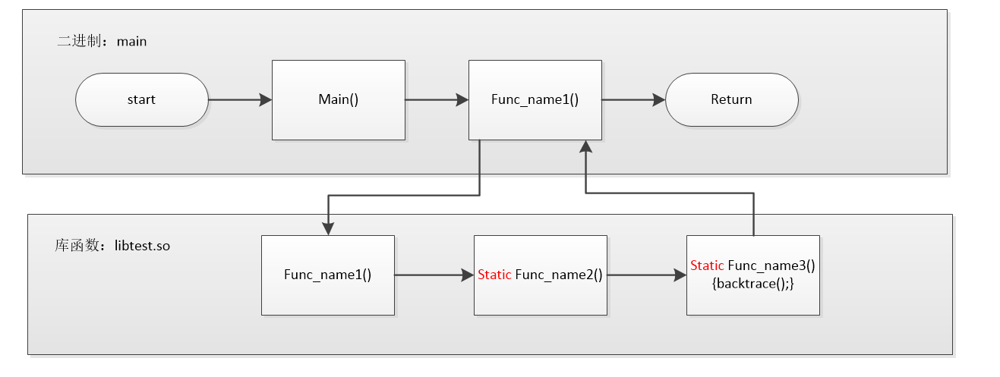
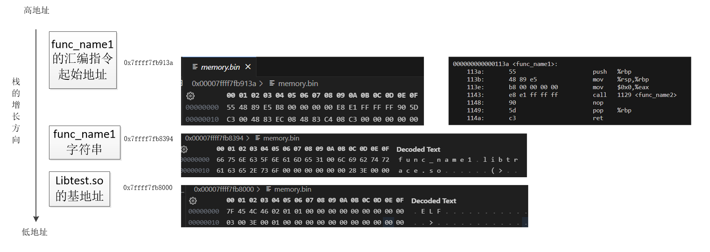

## 一. 简介

本文介绍一种不使用任何外部调试工具(GDB等)，在程序发生异常时及时记录堆栈信息的方法，它可以定位到库文件的函数名和行号。

* 本文先介绍backtrace系列函数，从而获取到函数调用栈的栈帧。
* 再通过BFD库(二进制文件描述库)来分析ELF文件，找到`.text节`和`.debug_info节`。
* 编写一个libtrace库，调试程序可以通过`backtrace_dump()`来查看函数调用栈。
* 最后[注册SIGSEGV的信号处理函数](#segv_handler)，通过libtrace定位到堆栈的源文件、函数名、行号

## 二. backtrace

本节的内容源自`man 3 backtrace`，原文中有一个测试程序，感兴趣可以去实际运行一下代码。

### 2.1 函数原型

```c
#include <execinfo.h>

int backtrace(void *buffer[.size], int size);

char **backtrace_symbols(void *const buffer[.size], int size);
```

### 2.2 backtrace()

`backtrace()`将回溯信息存放在buffer数组中。回溯信息包含一系列当前线程活跃的函数调用。buffer中的每个成员记录了函数(指令)的返回地址。

```text
buffer:[100]
    [0]: 0x7ffff7fbf913
    [1]: 0x7ffff7fbf9cb
    [2]: 0x7ffff7fb9126
    [3]: 0x7ffff7fb9137
    [4]: 0x7ffff7fb9148
    [5]: 0x555555555161
    [6]: 0x7ffff7df31ca
    [7]: 0x7ffff7df3285
    [8]: 0x555555555081
    [9]: 0x0
```

### 2.3 backtrace_symbols()

`backtrace_symbols()`将buffer中的一系列地址转换为易读的字符串。其中包含父函数名称、子函数(指令)在父亲函数中的的偏移、子函数的实际返回地址。

这里少了两层调用栈是因为我跳过了`backtrace_dump()`的调用栈打印

```text
strings:[]
    [0]: /home/zrf/git/study/utils/libtest.so(+0x1126) [0x7f2f83880126]
    [1]: /home/zrf/git/study/utils/libtest.so(+0x1137) [0x7f2f83880137]
    [2]: /home/zrf/git/study/utils/libtest.so(func_name1+0xe) [0x7f2f83880148]
    [3]: ./main(main+0x18) [0x55d657aa8161]
    [4]: /lib/x86_64-linux-gnu/libc.so.6(+0x271ca) [0x7f2f836ba1ca]
    [5]: /lib/x86_64-linux-gnu/libc.so.6(__libc_start_main+0x85) [0x7f2f836ba285]
    [6]: ./main(_start+0x21) [0x55d657aa8081]
```

### 2.4 注意事项

* 这两个函数都是线程安全的
* 想要获得更符合源码的调用栈信息，CC编译时需要不进行优化（指定-O0）
* 内联函数没有栈指针
* **不使用特定的链接选项`-rdynamic`将无法显示函数名称**
* 被定义为`static`的函数无法显示函数名

### 2.5 测试程序

在库libtest.so中，函数`func_name3()`调用`backtrace()`系列函数，将打印此时调用栈信息。
请注意`func_name2()`和`func_name3()`都被定义为了`static`类型，所以`backtrace_symbols()`无法显示函数名。


```bash
Debug backtrace: func_name3 backtrace
 dumping 7 stack frame addresses:
    /home/zrf/git/study/utils/libtest.so(+0x1126) [0x7f7433a15126]
    /home/zrf/git/study/utils/libtest.so(+0x1137) [0x7f7433a15137]
    /home/zrf/git/study/utils/libtest.so(func_name1+0xe) [0x7f7433a15148]
    ./main(main+0x18) [0x55f9d9be8161]
    /lib/x86_64-linux-gnu/libc.so.6(+0x271ca) [0x7f743384f1ca]
    /lib/x86_64-linux-gnu/libc.so.6(__libc_start_main+0x85) [0x7f743384f285]
    ./main(_start+0x21) [0x55f9d9be8081]
```

## 三. BFD

BFD库（二进制文件描述库）是GNU项目用于解决不同格式的目标文件的可移植性的主要机制。

以下内容摘自[BFD](https://en.wikipedia.org/wiki/Binary_File_Descriptor_library)

* BFD通过对目标文件提供公共抽象视图来达成工作。一个目标文件有带有描述信息的一个“头”；可变量目的“段”，每个段都有一个名字、一些属性和一块数据；一个符号表；一组重定位入口项；诸如此类。

* 在内部，BFD将数据从抽象视图转换到目标处理器和文件格式所要求的位/字节布局的细节。它的关键服务包括处理字节序差异，比如在小端序主机和大端序目标之间，在32-bit和64-bit数据之间的正确转换，和重定位入口项所指定的寻址算术的细节。

* 尽管BFD最初设计成为可以被各种工具使用的通用库，频繁需要修补API来容纳新系统的功能，倾向于限制了它的使用；BFD的主要用户是GNU汇编器（GAS），GNU连接器（GLD），和其他GNU二进制实用程序（"binutils"）工具，和GNU调试器（GDB）。因此，BFD不单独发行，总是包括在binutils和GDB发行之中。不论如何，BFD是将GNU工具用于嵌入式系统开发的关键部件。

* BFD库可以用来读取核心转储的结构化数据。

### 3.1 dladdr()

`dladdr()`检测给定的地址是否"合法"，如果合法，就返回一个Dl_info的结构，现在解释一下这个结构体中每个字段的含义：

#### 1. 结构体

```c
typedef struct {
    /* 
     *  动态链接库的路径名。这是一个指向字符串的指针
     *  例如 "/home/zrf/git/study/utils/libtest.so" 
     */
    const char *dli_fname;

    /*
     *  动态链接库在虚拟内存中的基地址
     */
    void       *dli_fbase;  

    /* 
     *  父函数的名称
     */
    const char *dli_sname;  

    /*
     *  父函数在虚拟内存中的地址
     */
    void       *dli_saddr;  
} Dl_info;
```

#### 2. 举例讲解dladdr

我举一个详细的例子来讲解这个结构体

在libtest.so中，我定义了一个名为`func_name1()`的函数，他的代码如下：

```c
void func_name1()
{
    func_name2();
}
```

接下来描述这个函数被调用时的栈信息：

* 0x7ffff7fb8000附近有ELF格式信息
* 0x7ffff7fb8394附近有函数名字符串
* 0x7ffff7fb913a附近有函数的具体指令



```text
    两个字符串指针：
        dli_fname字段指向了libtest.so的绝对路径
        dli_sname字段指向了函数的名称"func_name1"
    两个地址指针：
        dli_saddr字段指向了函数func_name1()的汇编指令起始地址。
        dli_fbase字段指向了libtest.so在虚拟内存的地址
```

我们再看下`backtrace()`的buffer字段中的地址值0x7ffff7fb9148


再结合func_name1()的汇编指令来观察：

```x86asm
000000000000113a <func_name1>:
    113a:       55                      push   %rbp
    113b:       48 89 e5                mov    %rsp,%rbp
    113e:       b8 00 00 00 00          mov    $0x0,%eax
    1143:       e8 e1 ff ff ff          call   1129 <func_name2>
    1148:       90                      nop
    1149:       5d                      pop    %rbp
    114a:       c3                      ret
```

可以发现指令`90 5D C3`就是`func_name1()`执行完调用`func_name2()`（`call   1129 <func_name2>`）后要执行的指令。到此为止，我们应该就可以**利用这些指针的相对位置，来定位调用栈的行号了**。

我们可以使用`backtrace()`的buffer字段中的地址值`0x7ffff7fb9148`来减去这个库文件的基地址`0x7ffff7fb8000`，得到一个偏移`0x1148`，结合刚刚的汇编指令，可以发现这个地址刚好就是从`func_name2()`返回后要执行的指令所在地址。

#### 3. addr2line

在介绍libbdf之前我们先介绍一个工具来查看指令所在的行——addr2line
查看刚刚打印的堆栈信息

```bash
Debug backtrace: func_name3 backtrace
 dumping 7 stack frame addresses:
    /home/zrf/git/study/utils/libtest.so(+0x1126) [0x7f7433a15126]
    /home/zrf/git/study/utils/libtest.so(+0x1137) [0x7f7433a15137]
    /home/zrf/git/study/utils/libtest.so(func_name1+0xe) [0x7f7433a15148]
    ./main(main+0x18) [0x55f9d9be8161]
    /lib/x86_64-linux-gnu/libc.so.6(+0x271ca) [0x7f743384f1ca]
    /lib/x86_64-linux-gnu/libc.so.6(__libc_start_main+0x85) [0x7f743384f285]
    ./main(_start+0x21) [0x55f9d9be8081]
```

例如：我们想看func_name1中具体是从哪一行调用了`backtrace()`
我们已经拿到了库文件的路径，也拿到了指令在库函数中的位置`func_name1+0xe`：

```bash
# 使用addr2line查看行号
zrf@debian:~/git/study/utils$ addr2line -e /home/zrf/git/study/utils/libtest.so func_name1+0xe -f -p 
func_name1 at /home/zrf/git/study/utils/libtest.c:17

```

### 3.2 libbfd

我们暂时总结一下现在收集到的栈信息(可以结合上文中提到的栈图片来观察)：

* libtest库的地址: `0x7ffff7fb8000`
* 父函数字符串: `0x7ffff7fb8394`
* 父函数完整的汇编指令: `0x7ffff7fb913a`
* 子函数回溯栈指针: `0x7ffff7fb9148`

接下来，我们将**使用这些地址信息**，并**结合libbfd库**，来**定位**回溯栈地址对应的指令所在的**源文件、函数名和代码行**。

#### 1. ELF文件格式

我将ELF文件分为五个部分:

```c
struct elf_file
{
    /* ELF 文件头 */
    struct elf_header;
    /* 段表 */
    struct program_header_table;
    /* 节表 */
    struct section_header_table;
    /* 本地符号表 */
    struct sysbol_table;
    /* 动态链接符号表 */
    struct dynamic_symbol_table;
};
```

我们首先要做的就是找到ELF文件的符号表并记录下来，再找到当前指令的调试信息在符号表中的偏移，我们拿着符号表和偏移地址就可以找到找到.debug_info、.debug_line等信息，这些节中就包含当前指令地址所对应的源码文件、函数名和行号。
我们可以通过`readelf --debug libtest.so`来查看

```bash
    <2b7>   DW_AT_external    : 1
    <2b7>   DW_AT_name        : (indirect string, offset: 0x2e): func_name3
    # 文件entry，可以通过File Name Table来索引到源文件
    <2bb>   DW_AT_decl_file   : 1
    # 行号
    <2bb>   DW_AT_decl_line   : 4
    <2bc>   DW_AT_decl_column : 6
    <2bc>   DW_AT_low_pc      : 0x1129
    <2c4>   DW_AT_high_pc     : 0x20
    <2cc>   DW_AT_frame_base  : 1 byte block: 9c        (DW_OP_call_frame_cfa)
    <2ce>   DW_AT_call_all_tail_calls: 1

The File Name Table (offset 0x38, lines 7, columns 2):
  Entry Dir     Name
  0     0       (indirect line string, offset: 0): libtest.c
  1     0       (indirect line string, offset: 0): libtest.c
  2     1       (indirect line string, offset: 0x99): stddef.h
  3     2       (indirect line string, offset: 0xa2): types.h
  4     3       (indirect line string, offset: 0xaa): struct_FILE.h
  5     3       (indirect line string, offset: 0xb1): FILE.h
  6     0       (indirect line string, offset: 0xb8): backtrace.h
```

#### 2. BFD重要的函数

```c
/* 通过文件名创建一个bfd实例 */
bfd *bfd_openr (const char *filename, const char *target);

/* 获取符号表大小的宏定义 */
bfd_get_dynamic_symtab_upper_bound(abfd)

/* 获取动态链接符号表的宏定义 */
bfd_canonicalize_dynamic_symtab(abfd, asymbols)

/* 获取本地链接符号表的宏定义 */
bfd_canonicalize_symtab(abfd, location)

/* 遍历每一个节，并调用func进行处理 */
void bfd_map_over_sections
   (bfd *abfd,
    void (*func) (bfd *abfd, asection *sect, void *obj),
    void *obj);

/* 
 *  通过bfd实例、.text节、符号表、指令相对于符号表的偏移，
 *  来获取文件名、函数名、行号
 */
#define bfd_find_nearest_line(abfd, sec, syms, off, file, func, line)
```

我们来看下libtrace库中最重要的函数`backtrace_dump()`流程图


### 3.3 最终效果

```bash
Debug backtrace: func_name3 backtrace
 dumping 7 stack frame addresses:
  /home/zrf/git/study/utils/libtest.so @ 0x7fc3c8714000 [0x7fc3c8715126]
    -> source file[/home/zrf/git/study/utils/libtest.c] function[func_name3] line[7]
  /home/zrf/git/study/utils/libtest.so @ 0x7fc3c8714000 [0x7fc3c8715137]
    -> source file[/home/zrf/git/study/utils/libtest.c] function[func_name2] line[12]
  /home/zrf/git/study/utils/libtest.so @ 0x7fc3c8714000 (func_name1+0xe) [0x7fc3c8715148]
    -> source file[/home/zrf/git/study/utils/libtest.c] function[func_name1] line[17]
  ./main @ 0x55d2d7f65000 (main+0x18) [0x55d2d7f66161]
  /lib/x86_64-linux-gnu/libc.so.6 @ 0x7fc3c8522000 [0x7fc3c85491ca]
    -> source file[./csu/../sysdeps/x86/libc-start.c] function[__libc_start_call_main] line[74]
  /lib/x86_64-linux-gnu/libc.so.6 @ 0x7fc3c8522000 (__libc_start_main+0x85) [0x7fc3c8549285]
    -> source file[./csu/../csu/libc-start.c] function[call_init] line[128]
  ./main @ 0x55d2d7f65000 (_start+0x21) [0x55d2d7f66081]
```

### 3.4 总结

我们可以使用这种方法更加准确的定位到库文件的源码名称、函数名（`backtrace_symbols()`是无法显示被定义为`static`类型的函数名的，但是我们这个方法可以拿到函数名）、以及行号。

我将这种方法编译为了一个动态库——libtrace.so，如果想使用这个功能，在希望打印调用栈时调用`backtrace_dump()`就可以了

```c
/* 
 *  char *label:    一个标记
 *  FILE *file：    调用栈的输出流，如果为NULL，则输出到stderr
 *  bool detailed:  是否显示行号
 */
void backtrace_dump(char *label, FILE *file, bool detailed);
```

由于libtrace只对库文件中的符号表做了打印行号的功能，所以针对本地的符号是不打印行号的（如果有必要的话，当然后续可以继续完善）。

## 四. 通过信号处理函数打印调用栈

开发中，难免会遇到堆栈情况，除了gdb外，我们也可以注册SIGSEGV信号的信号处理函数，如果发生堆栈，则打印调用栈

看下代码：

`main()`函数中会调用`terrible_function()`,他在一个名为libtest.so的库中，并且这个函数会产生堆栈。

<span id="segv_handler">

* `main()`函数

```c
#include <stdio.h>
#include <stdlib.h>
#include <signal.h>
#include "backtrace.h"

extern void terrible_function();

static void segv_handler(int signal)
{
  backtrace_dump("SIGSEGV", NULL, true);
  abort();
}

int main()
{
  backtrace_init();

  /* 信号处理 */
  struct sigaction action;
  action.sa_handler = segv_handler;
  sigaction(SIGSEGV, &action, NULL);

  /* 异常函数 */
  terrible_function();

  backtrace_deinit();
  return 0;
}
```

* `libtest.so中的terrible_function()`

```c
#include <stdio.h>

void terrible_function()
{
    printf("%s\n", __LINE__);
}
```

* 看下运行效果：

```bash
zrf@debian:~/git/study/utils$ ./main 
Debug backtrace: SIGSEGV
 dumping 10 stack frame addresses:
  ./main @ 0x557de421b000 [0x557de421c1ad]
  /lib/x86_64-linux-gnu/libc.so.6 @ 0x7f3cc9464000 [0x7f3cc949ffd0]
    -> source file[libc_sigaction.c] function[__restore_rt] line[0]
  /lib/x86_64-linux-gnu/libc.so.6 @ 0x7f3cc9464000 [0x7f3cc95cb618]
    -> source file[./string/../sysdeps/x86_64/multiarch/strlen-evex.S] function[__strlen_evex] line[79]
  /lib/x86_64-linux-gnu/libc.so.6 @ 0x7f3cc9464000 [0x7f3cc94c2168]
    -> source file[./stdio-common/./stdio-common/vfprintf-process-arg.c] function[__vfprintf_internal] line[397]
  /lib/x86_64-linux-gnu/libc.so.6 @ 0x7f3cc9464000 (_IO_printf+0xab) [0x7f3cc94b656b]
    -> source file[./stdio-common/./stdio-common/printf.c] function[__printf] line[37]
  /home/zrf/git/study/utils/libtest.so @ 0x7f3cc9656000 (terrible_function+0x1d) [0x7f3cc9657126]
    -> source file[/home/zrf/git/study/utils/libtest.c] function[terrible_function] line[6]
  ./main @ 0x557de421b000 (main+0x46) [0x557de421c1f8]
  /lib/x86_64-linux-gnu/libc.so.6 @ 0x7f3cc9464000 [0x7f3cc948b1ca]
    -> source file[./csu/../sysdeps/x86/libc-start.c] function[__libc_start_call_main] line[74]
  /lib/x86_64-linux-gnu/libc.so.6 @ 0x7f3cc9464000 (__libc_start_main+0x85) [0x7f3cc948b285]
    -> source file[./csu/../csu/libc-start.c] function[call_init] line[128]
  ./main @ 0x557de421b000 (_start+0x21) [0x557de421c0c1]
Aborted
```

可以发现我们获取了完整的调用栈，可以定位到`source file[/home/zrf/git/study/utils/libtest.c] function[terrible_function] line[6]`这个函数出了问题

## 五. libtrace

本节将介绍libtrace库的代码实现。

### 5.1 backtrace()

这里不做赘述，请直接参考`man 3 backtrace`，我们的目的就是通过这个函数拿到栈帧。

### 5.2 dladdr()

已经很详细的讲解了这个函数，请回顾`3.1 节`。我们的目的是通过这个函数拿到动态库在内存中的基地址，使用栈帧减去基地址得到指令在动态库中的偏移。

```c
dladdr(this->frames[i], &info);
void *ptr = this->frames[i];

if (strstr(info.dli_fname, ".so"))
{
  ptr = (void*)(this->frames[i] - info.dli_fbase);
}
```

### 5.3 print_sourceline()

```c
/* 这个函数打印行号的入口 */
static void print_sourceline(FILE *file, char *filename, void *ptr);
```

* file：输出流，如果为NULL，则输出到stderr
* filename：库文件的绝对路径
* ptr：指令在动态库中的偏移

这个函数中有三个重要步骤
* 在缓存中查找是否存在动态库的bfd实例，如果存在则返回实例，否则创建一个实例，并加入缓存
* 调用`bfd_map_over_sections()`遍历每个节，找到.text
* 在.text节中使用`bfd_find_nearest_line()`来获取源文件、函数名、行号

```c
pthread_mutex_lock(&bfd_mutex);
/* 从哈希表中查找filename对应的bfd实例（这里使用的是uthash.h） */
entry = get_bfd_entry(filename);
if (entry)
{
  data->entry = entry;
  /* 遍历每个节, 对每个节调用find_addr函数 */
  bfd_map_over_sections(entry->abfd, (void*)find_addr, data);
}
pthread_mutex_unlock(&bfd_mutex);
```

```c
static void find_addr(bfd *abfd, asection *section, bfd_find_data_t *data)
{
  vma = bfd_section_vma(section);
  
  /* 获取源文件、函数名、行号 */
  data->found = bfd_find_nearest_line(abfd, section, data->entry->syms,
                  data->vma - vma, &source, &function, &line);

  println(data->file, "    -> source file[%s] function[%s] line[%d]\n", source, function, line);
}
```

### 5.4 源码下载连接

* [github链接](https://github.com/zrf-1998/study/tree/main/utils)
* [直接下载](http://39.99.231.133/source/backtrace.tar.gz)